# MUMSRELLE 与 Flommie 改进分级及数据架构报告

_项目：MRL + Flommie Internal Management Dashboard；审查日期：2026-09-16（SGT）；范围：只读分析、页面修复与数据模型设计_

---

## 执行结论

本次审查确认，当前最大风险不是 Google Sheets 公式数量，而是**业务质量门已阻断，但历史数字仍可能被解读为当前已确认结果**。2026-09-16 23:11 SGT 最终重新读取 `MRL Results Tracker` 的 `Data Checks!A1:E40` 后，`SC header`、`Month sequence`、`SC numeric / composition`、`MRL gate` 与 `Stock composition` 均为 `BLOCK`；库存含义仍为 `BOOK ONLY`。该结果与 22:42 SGT 的首次读取经排序 JSON 确定性比较完全一致。因此，MRL 历史 KPI 与 Flommie 历史账面库存只能保留作追溯证据，不得用于当前经营决策。

项目现已直接补上当前质量门提示、历史证据标签、四层数据流、三条主工作流、一个统一暂停流程、三条异议快捷流程、十张表的数据字典，以及四项必须由业务负责人批准的归属规则。公式与 Apps Script 明确保留到架构和规则批准之后，避免因 KPI 定义变更而返工。

## 工单分级

| 优先级 | 分类 | 影响范围 | 当前状态 | 已执行处理 | 路由建议 |
| --- | --- | --- | --- | --- | --- |
| **P1** | Data / 数据准确性 | MUMSRELLE 管理 KPI、Flommie 库存判断 | 当前实时质量门为 `BLOCK`，历史数字先前仍以高显著度显示 | 已在首屏增加实时质量门警告；MRL 与库存数值改为 `HISTORICALLY VERIFIED`；连接可读与质量通过分开显示 | 数据负责人 + 运营负责人 |
| **P2** | Integration / 数据架构 | Respond.io、Aoikumo、Google Sheets、Dashboard | 跨系统主键、事件粒度和归属规则未形成单一设计 | 已新增四层数据流与十表数据字典；Aoikumo 固定为 appointment operations 权威来源 | 产品 / 数据工程 / 运营 |
| **P2** | Data / KPI 定义 | Blast、Appointment、Attendance、Payment、Signup | CSO 转移、取消、改期、付款归属日期仍未批准 | 已建立四项 `PENDING VERIFICATION` 决策；未强制归属 | 业务负责人 + 财务/运营 |
| **P3** | UX / 移动端效率 | 移动端自动化登记表 | 页面可读，但现有自动化表仍密集且依赖横向滚动 | 本次未改登记表的数据呈现逻辑；保留为下一阶段 | 前端 / 产品 |
| **P3** | Performance / 前端载荷 | 首次加载 | 生产构建成功，但主 JavaScript chunk 为 1,275.29 kB（gzip 334.76 kB），超过 Vite 的 500 kB 提示阈值 | 本次未混入代码拆分重构；保留为独立性能工单 | 前端工程 |
| **P4** | Feature request / 公式与自动同步 | Google Sheets、Apps Script | 结构与 KPI 规则尚未批准 | 明确后置，不在本次写公式或启用自动同步 | 数据工程，待 P2 完成后 |

> **分级说明：** 这里的 P1–P4 使用工单影响框架。现有 Dashboard 内的 `P0` / `P1` 是历史快照中的管理建议优先级，两者不是同一套严重度定义。

## 当前已验证

本次通过 Google Workspace CLI 以只读方式检查三个来源的 Drive 元数据和工作簿结构，并对 `MRL Results Tracker` 的五个范围分别读取原始值与公式。读取过程没有写入 Google Sheets，没有启用或运行 Make，也没有访问或展示客户个人资料。

| 项目 | 当前证据 |
| --- | --- |
| 检索时间 | 2026-09-16 22:41–22:42 SGT；最终复核 23:11 SGT |
| 主要工作簿 | `MRL Results Tracker`，ID `1iTHf8aF4vZVGnKYolu_pb8tuC5fcMCBFD71Rw533poQ` |
| 当前 Drive 修改时间 | 2026-09-16 01:00:20.045 UTC |
| 已读范围 | `Data Checks!A1:E40`、`Last Verified Feed!A1:O25`、`Monthly Results!A1:K30`、`Flommie Stock!A1:N45`、`Automation Progress!A1:N60` |
| 读取模式 | `UNFORMATTED_VALUE` 与 `FORMULA` 分开读取 |
| MRL 质量门 | `SC header = BLOCK`；`Month sequence = BLOCK`；`SC numeric / composition = BLOCK`；`MRL gate = BLOCK` |
| Flommie 质量门 | `Stock composition = BLOCK`；`Stock meaning = BOOK ONLY` |
| 业务期间 | `PENDING VERIFICATION`；来源本身说明 retrieval time 不等于 business as-of |
| Dashboard 当前行为 | 首屏显示当前阻断；历史数字不再标为当前确认；十表架构可展开检查 |
| 交互验证 | 无页面级横向溢出；无重复 ID；10 个字段卡默认关闭且可展开；主题切换有效；详情抽屉支持 Escape、焦点进入和焦点恢复 |

## 历史已验证

以下内容只代表历史证据，不代表 2026-09-16 的当前经营状态。项目保留这些数值用于追溯，但在界面中已降级为 `HISTORICALLY VERIFIED`。

| 历史证据日期 | 范围 | 历史内容 | 当前限制 |
| --- | --- | --- | --- |
| 2026-09-14 快照；结果截至 2026-09-13 | MRL Results | SC-only 历史 YTD 为 SGD 732,105.97；Sep proxy 为 SGD 34,142.25 | 当前 `MRL gate = BLOCK`，不得作为当前 KPI 结论 |
| 2026-09-11 | Flommie Stock | 历史账面 closing 24,556 packs、reserved 26、book available 24,530 | 当前 `Stock composition = BLOCK`；不是物理库存，也不是可承诺库存 |
| 2026-09-14 快照 | Automation registry | 49 个来源登记记录，其中 44 个 new/planned、5 个 existing-live | 不能由登记状态推断 runtime 或 go-live；现有页面保留各证据门分离 |

## 拟议数据流

下图是本次落地到 Dashboard 的**拟议架构**，不是已运行的生产同步。Respond.io 负责 outbound event 与 contact identity；Aoikumo 是 appointment operations 的权威来源；Aoikumo Payment 的只读事件访问仍待取得和验证。

```mermaid
flowchart LR
    accTitle: MUMSRELLE and Flommie data flow
    accDescr: Respond.io and Aoikumo source events enter immutable raw tables, pass deterministic identity and attribution rules, generate quality-gated daily CSO metrics, and then appear in the management dashboard.

    respond_io[Respond.io events] --> raw_respond[Raw_Respond]
    aoikumo_appointment[Aoikumo appointment events] --> raw_appointment[Raw_Appointment]
    aoikumo_payment[Aoikumo payment events] --> raw_payment[Raw_Payment]

    raw_respond --> identity_bridge[Bridge_Contact_Identity]
    raw_appointment --> identity_bridge
    raw_payment --> identity_bridge

    identity_bridge --> blast_fact[Fact_Blast_Ownership]
    identity_bridge --> appointment_fact[Fact_Appointment_Lifecycle]
    identity_bridge --> payment_fact[Fact_Payment_Attribution]

    blast_fact --> daily_kpi[Daily_CSO_KPI]
    appointment_fact --> daily_kpi
    payment_fact --> daily_kpi
    daily_kpi --> quality_gate{Quality gate passed?}
    quality_gate -->|Yes| dashboard[Dashboard_Control]
    quality_gate -->|No| paused[PAUSED_PENDING_VERIFICATION]

    classDef source fill:#dbeafe,stroke:#2563eb,stroke-width:2px,color:#1e3a5f
    classDef process fill:#f3f4f6,stroke:#6b7280,stroke-width:2px,color:#1f2937
    classDef decision fill:#fef9c3,stroke:#ca8a04,stroke-width:2px,color:#713f12
    classDef blocked fill:#fee2e2,stroke:#dc2626,stroke-width:2px,color:#7f1d1d

    class respond_io,aoikumo_appointment,aoikumo_payment source
    class raw_respond,raw_appointment,raw_payment,identity_bridge,blast_fact,appointment_fact,payment_fact,daily_kpi,dashboard process
    class quality_gate decision
    class paused blocked
```

## 三条主工作流与统一暂停流程

| 工作流 | 输入 | 核心规则 | 输出 |
| --- | --- | --- | --- |
| Blast & ownership | Respond.io immutable outbound event | 每个 `message_event_id` 只计一次；保存 event time 的 owner，不用当前 owner 覆盖历史 | `Fact_Blast_Ownership` |
| Appointment & attendance | Aoikumo appointment lifecycle events | 创建、改期、取消、出席、未到分开；相同 `appointment_id` 保留完整事件历史 | `Fact_Appointment_Lifecycle` |
| Payment & signup | Aoikumo payment events | posted、void、reversal、refund 分开；payment date 与 appointment date 分开 | `Fact_Payment_Attribution` |
| Unified pause | 缺来源、主键、事件历史或规则批准 | 使用唯一状态 `PAUSED_PENDING_VERIFICATION`；记录保留但不强制归属 | Audit queue |

三条异议快捷流程固定为 `Not interested`、`Timing / not now` 与 `Price / affordability`。它们只做分类；不自动发送消息，不触发 offer、booking 或 payment。涉及后续联系的内容继续保持 `DRAFT ONLY`。

## 十张表的设计摘要

| 表名 | 层级 | 粒度 | 主键 | 权威来源 | 审计状态 |
| --- | --- | --- | --- | --- | --- |
| `Raw_Respond` | RAW | 一条不可变 outbound message / shortcut event | `message_event_id` | Respond.io | PROPOSED |
| `Raw_Appointment` | RAW | 一条 appointment lifecycle event | `appointment_event_id` | Aoikumo | PENDING VERIFICATION |
| `Raw_Payment` | RAW | 一条 posted / voided / reversed / refunded event | `payment_event_id` | Aoikumo | PENDING VERIFICATION |
| `Ref_CSO` | REFERENCE | 一条 CSO identity 有效期记录 | `cso_record_id` | 已批准运营目录 | PENDING VERIFICATION |
| `Bridge_Contact_Identity` | LINK | 一条 Respond.io 与 Aoikumo 客户身份映射 | `identity_link_id` | 已批准确定性映射 | PROPOSED |
| `Fact_Blast_Ownership` | LINK | 一条 qualifying blast 及一次归属决定 | `blast_fact_id` | Respond.io + approved rule | PROPOSED |
| `Fact_Appointment_Lifecycle` | LINK | 一个 appointment 的当前状态与完整历史 | `appointment_id` | Aoikumo | PROPOSED |
| `Fact_Payment_Attribution` | LINK | 一条 net payment event 及 signup 归属 | `payment_event_id` | Aoikumo + approved rule | PROPOSED |
| `Daily_CSO_KPI` | KPI | 一个日期、CSO、metric、rule version | `daily_kpi_id` | 仅由通过验证的 facts 派生 | PROPOSED |
| `Dashboard_Control` | KPI | 一个 Dashboard section 与 as-of checkpoint | `control_id` | Dashboard audit controls | PROPOSED |

完整字段、数据类型、必填性和说明已在 Dashboard 的 `Data Design` 区内逐表展开；同一份定义由 `shared/dataArchitecture.ts` 提供并由自动测试约束。

## 待验证

| 决策 | 当前拟议规则 | 为什么仍不能视为事实 |
| --- | --- | --- |
| Contact 转给两个 CSO 时如何归属 | 保存每个事件发生时的 owner，不用当前 owner 覆盖历史 | 需要业务负责人批准归属政策与有效日期 |
| Cancelled Appointment 是否计入 | 保留 lifecycle，但排除 current booked / attended KPI | 需要批准 KPI 口径与取消时间窗 |
| Reschedule 是否算新 Appointment | 相同 `appointment_id` 下记录 `RESCHEDULED`，不重复计数 | 需要确认 Aoikumo 是否提供稳定 ID 和完整事件历史 |
| Payment / Signup 按哪一天归属 | payment/signup KPI 使用 payment time；appointment date 保留作独立维度 | 需要财务与运营批准，并取得 Aoikumo payment event 证据 |
| Respond.io sender 与 delivery success | 仅在 provider 证据存在时记录，不把 outgoing 当 successful blast | 当前缺完整 sender / delivery-status 历史证据 |
| 当前 appointment 与 payment 链路 | Aoikumo 只读接口、ID、status history 与 payment history | 当前尚未取得已批准端点或连接，必须保持 `PENDING VERIFICATION` |

## 实施与验证记录

本次修改没有改变 Google Sheets、Make、Respond.io、Aoikumo、appointment、payment 或 customer messaging。页面源代码增加了共享架构模型和质量门判断；自动测试覆盖十表唯一性、主键存在、Aoikumo 权威来源、三主流程、统一暂停流程、三异议快捷流程、四项待验证归属决策、阻断数据降级，以及旧数据库快照缺少审计覆盖层时的兼容处理。

最终验证运行了 `pnpm test`、`pnpm check`、`pnpm build`、Mermaid/Markdown 渲染、`git diff --check` 与敏感信息模式扫描。结果为 **4 个测试文件、14 项测试全部通过**，TypeScript 检查通过，生产构建成功，报告图表成功渲染，差异格式检查通过，敏感信息模式扫描无匹配。Vite 同时报告主 JavaScript chunk 超过 500 kB 的非阻断警告；该问题已单独列为 P3，未与本次数据语义修复混合处理。
